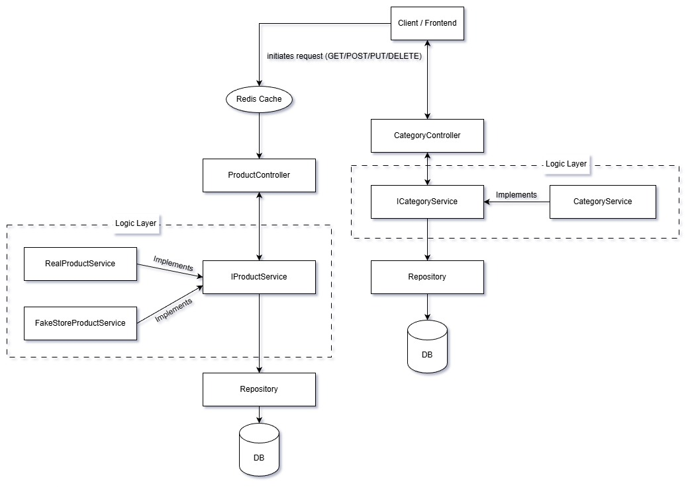

## eCommerce Product Management System

### Overview

This project provides a backend service for managing eCommerce product information (name, description, price, etc.). Clients such as web or mobile apps can interact with the product catalog through RESTful HTTP endpoints.


---
### Core Features

- Add new products
- Retrieve product details (single or all)
- Update existing products
- Delete products
- Robust data validation and error handling
- Secure data transfer via DTOs
---
### Architecture

- **Controller Layer:** Handles HTTP requests/responses, maps endpoints, delegates to the service layer.
- **Service Layer:** Contains business logic, validation, and data transformation.
- **Repository Layer:** Interfaces with SQL database using Spring Data JPA.
- **Model/Entity Layer:** Product entity definitions mapped to the database.
- **DTOs:** Used for secure request/response payloads.

---
### Technologies

- Java
- Spring Boot
- Spring Data JPA
- Maven
- SQL : MySQL
- Hibernate

---

### Features

- RESTful endpoints for CRUD product operations
- SQL database integration (MySQL)
- Caching (Redis)
- Exception handling, validation, and logging (SLF4J)

---

### Prerequisites

- Java 17+
- Maven 3.6+
- MySQL database
- Git

---

### API Endpoints

| Method | Endpoint                   | Description                |
| ------ | -------------------------- | -------------------------- |
| GET    | `/products/get`            | Retrieve all products      |
| GET    | `/products/get/{id}`       | Retrieve a product by ID   |
| POST   | `/products`                | Add a new product          |
| PUT    | `/products/{id}`           | Update an existing product |
| DELETE | `/products/{id}`           | Delete a product           |
| GET    | `/categories/{id}`         | Retrieve a category by ID  |
| POST   | `/categories`              | Add a new category         |
| PUT    | `/categories`              | Update a category          |

---

### Project Structure

```
src/main/java/
├──com/ecommerce/productservice
 ├── controllers # REST controllers
 ├── services # Business logic
 ├── repositories # Data access layer
 ├── dtos # Data Transfer Objects
 ├── configurations # Rest and Auth Configurations
 ├── exceptions # Custom Exception definitions
 ├── exceptionHandlers # Exception handlers
 └── model # Entity classes
src/main/resources # Config files
```

---

### Contact

For questions or support, contact [jayarajeshv](https://github.com/jayarajeshv).
